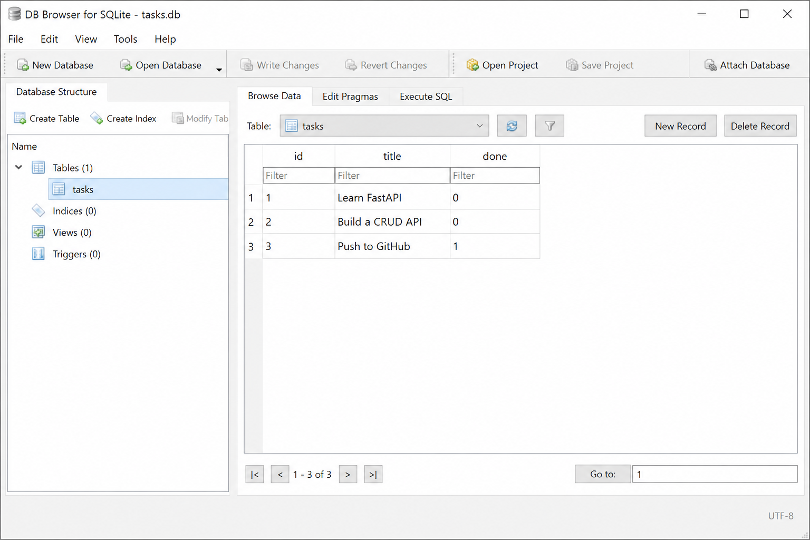
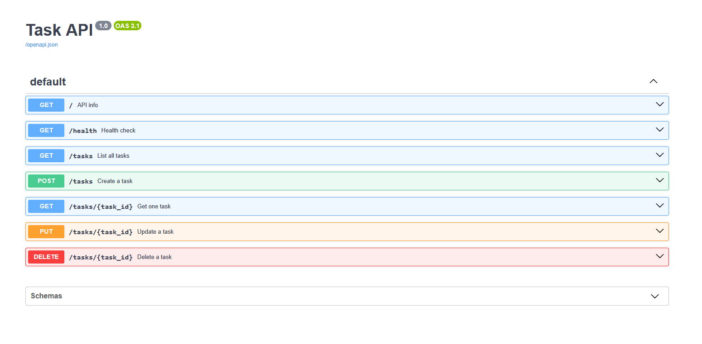

# Task API

A simple to-do list CRUD API built with FastAPI (Python).
Tasks are stored in a SQLite database (`tasks.db`), so they survive server restarts.

## Why SQLite?

SQLite is a lightweight database in a single file. No separate server to install — good for learning and small projects.

## Where is the database?

The file `tasks.db` is created automatically in the project folder the first time you run the app.
It is gitignored, so each clone gets a fresh database with 3 example tasks.

## How to run

```bash
python -m venv .venv
.\.venv\Scripts\Activate.ps1
pip install -r requirements.txt
uvicorn main:app --reload --port 8000
```

Then open http://localhost:8000/docs for Swagger UI.

## Endpoints

| Method | Endpoint | Description |
|--------|----------|-------------|
| GET | / | API info |
| GET | /health | Health check |
| GET | /tasks | List all tasks |
| GET | /tasks/{id} | Get one task |
| POST | /tasks | Create a task |
| PUT | /tasks/{id} | Update a task |
| DELETE | /tasks/{id} | Delete a task |

## Example curl

```bash
curl -i http://localhost:8000/tasks/1
```

```text
HTTP/1.1 200 OK
content-type: application/json

{"id":1,"title":"Learn FastAPI","done":false}
```

## Example SQL query

```sql
SELECT * FROM tasks WHERE done = 1;
```

This returns only completed tasks from the database.

## Database screenshot



## Swagger screenshot


