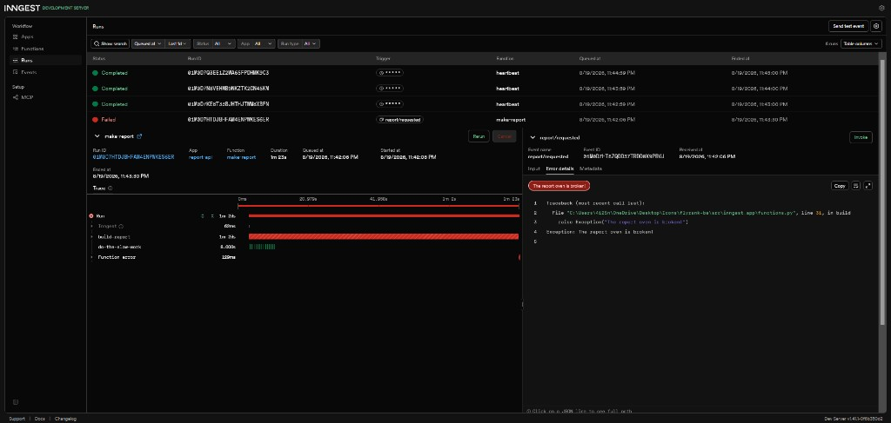
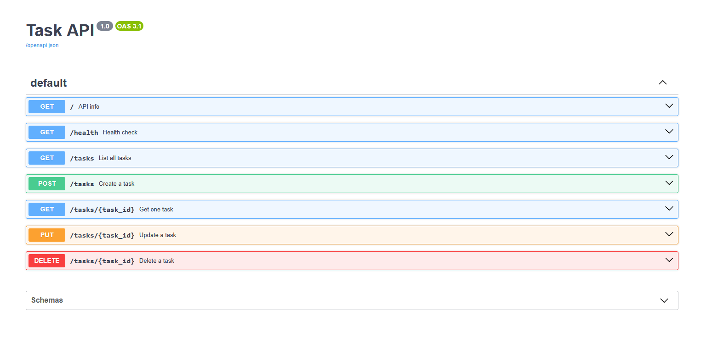

# Report API (Inngest)

Small FastAPI app. The slow report work runs in the background with Inngest.
I also kept my earlier task CRUD and triage stuff in this repo.

## Run it

You need two terminals.

API:

```bash
python -m venv .venv
.\.venv\Scripts\Activate.ps1
pip install -r requirements.txt
copy .env.example .env
uvicorn main:app --reload --port 8000
```

Inngest:

```bash
npx inngest-cli@latest dev -u http://localhost:8000/api/inngest
```

- docs: http://localhost:8000/docs
- inngest: http://localhost:8288

## Try a report

```bash
curl -i -X POST http://localhost:8000/reports -H "Content-Type: application/json" -d "{\"topic\":\"onboarding\"}"
```

I got something like:

```text
HTTP/1.1 202 Accepted
{"id":"23d99c53-7968-44c1-bca6-9bcef35f2cf9","status":"pending"}
```

That came back in under a second. Then I polled:

```bash
curl -i http://localhost:8000/reports/23d99c53-7968-44c1-bca6-9bcef35f2cf9
```

First time it was still pending. After ~8 seconds:

```json
{
  "id": "23d99c53-7968-44c1-bca6-9bcef35f2cf9",
  "topic": "onboarding",
  "status": "done",
  "result": "Report ready about: onboarding"
}
```

If you leave out the topic you get a 400 and no job is created.

If you send `"topic":"fail"` the job errors on purpose so you can see retries in the dashboard (2 retries, so 3 tries total).

A bad body is a wrong input so we reject it right away. A crash while building the report is a wrong moment so Inngest retries it.

## Cron

`heartbeat` runs every minute and prints how many reports are pending/done/failed.

- every day at 8am: `0 8 * * *`
- every Sunday at 10pm: `0 22 * * 0`

## Endpoints / functions

| Type | Name | Notes |
|------|------|-------|
| GET | /health | ok check |
| POST | /reports | 202 + id |
| GET | /reports/{id} | pending then done |
| fn | say-hello | sleeps 5s |
| fn | make-report | sleeps 8s then builds (retries=2) |
| fn | heartbeat | cron every minute |

## Env

Copy `.env.example`. Keep `INNGEST_DEV=1` for local Inngest.

For the older triage endpoint you also need the LLM vars if you use that.

## Screenshots




