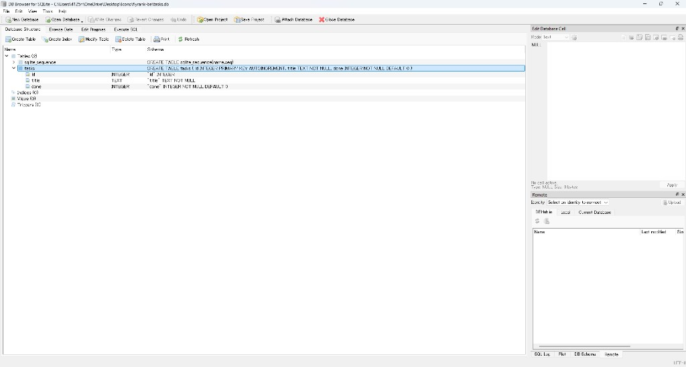

# Task API + background reports (Inngest)

FastAPI app with:
1. To-do list CRUD (SQLite)
2. Support triage as a background job
3. Report jobs via Inngest (this assignment)

## How to run (two terminals)

Terminal 1 - API:

```bash
python -m venv .venv
.\.venv\Scripts\Activate.ps1
pip install -r requirements.txt
copy .env.example .env
uvicorn main:app --reload --port 8000
```

Terminal 2 - Inngest Dev Server:

```bash
npx inngest-cli@latest dev -u http://localhost:8000/api/inngest
```

Then open:
- API docs: http://localhost:8000/docs
- Inngest dashboard: http://localhost:8288

Set `INNGEST_DEV=1` in `.env` (already in `.env.example`).

## Reports (Inngest background job)

Queue a report (returns fast with 202):

```bash
curl -i -X POST http://localhost:8000/reports -H "Content-Type: application/json" -d "{\"topic\":\"onboarding\"}"
```

Example:

```text
HTTP/1.1 202 Accepted
{"id":"...","status":"pending"}
```

Poll status:

```bash
curl -i http://localhost:8000/reports/ID_HERE
```

First poll is usually `pending`. After about 8 seconds it becomes `done` with a result.

Missing topic returns 400 (rejected at the door, no job created).

Topic `"fail"` makes the worker throw so you can watch retries in the dashboard (3 attempts total: original + 2 retries).

### Wrong input vs wrong moment

Wrong input (no topic) is rejected with 400 before any job starts.
Wrong moment (worker crash, like topic "fail") deserves retries because the input was fine but the run failed.

## Cron heartbeat

The `heartbeat` function runs every minute (`* * * * *`) and logs how many reports are pending / done / failed.

Cron answers:
1. Every day at 08:00: `0 8 * * *`
2. Every Sunday at 22:00: `0 22 * * 0`

## Endpoints and functions

| Kind | Name | What it does |
|------|------|--------------|
| Endpoint | `GET /health` | Health check |
| Endpoint | `POST /reports` | Queue report, return 202 |
| Endpoint | `GET /reports/{id}` | pending then done (+ result) |
| Inngest | `say-hello` | Sleep 5s, return hello (Stage 1 test) |
| Inngest | `make-report` | Sleep 8s, build report (retries=2) |
| Inngest | `heartbeat` | Cron every minute, log summary |

## Triage (optional / earlier work)

`POST /triage` also returns 202 and you poll `GET /triage/jobs/{id}`.
See [JOB-CARD.md](JOB-CARD.md) for the AI triage rules.

## Env vars (LLM triage)

| Variable | Example |
|----------|---------|
| `LLM_BASE_URL` | `https://openrouter.ai/api/v1` |
| `LLM_API_KEY` | your key |
| `LLM_MODEL` | `openrouter/free` |
| `LLM_STUB` | `1` for fake answers |
| `LLM_ENABLED` | `false` to turn triage off |
| `INNGEST_DEV` | `1` for local Inngest |

## Screenshots

Add an Inngest dashboard screenshot here after you run a successful report, a failed "fail" topic, and a heartbeat:





